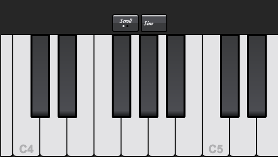

# Ember Piano Keyboard

**[Demo](http://brandynbennett.com/piano/)**

This Ember app uses the [Web Audio API](https://developer.mozilla.org/en-US/docs/Web/API/Web_Audio_API)
to create an interactive piano keyboard. The keyboard works on mobile as well as desktop.

Features include:

* Computer keyboard key bindings on desktop
* Toggle between different keyboard types
* Toggle between scroll mode and glissando mode

## Prerequisites

You will need the following things properly installed on your computer.

* [Git](https://git-scm.com/)
* [Node.js](https://nodejs.org/) (with NPM)
* [Ember CLI](https://ember-cli.com/)
* [PhantomJS](http://phantomjs.org/)

## Installation

* `git clone https://github.com/brandynbennett/piano-keyboard.git` this repository
* `cd piano-keyboard`
* `npm install`

## Running / Development

* `ember serve`
* Visit your app at [http://localhost:4200](http://localhost:4200).

### Code Generators

Make use of the many generators for code, try `ember help generate` for more details

### Running Tests

* `ember test`
* `ember test --server`

### Building

* `ember build` (development)
* `ember build --environment production` (production)

## Further Reading / Useful Links

* [ember.js](http://emberjs.com/)
* [ember-cli](https://ember-cli.com/)
* Development Browser Extensions
  * [ember inspector for chrome](https://chrome.google.com/webstore/detail/ember-inspector/bmdblncegkenkacieihfhpjfppoconhi)
  * [ember inspector for firefox](https://addons.mozilla.org/en-US/firefox/addon/ember-inspector/)
